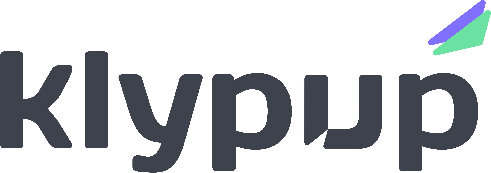

<p align="center">
  
</p>

<p align="center">
  <strong>AI-Powered Investment Research Dashboard</strong><br>
  Natural-language queries → agentic AI → structured, source-attributed analysis.
</p>

<p align="center">
  <a href="#"></a>
  <a href="#"></a>
  <a href="https://react.dev"></a>
  <a href="https://fastapi.tiangolo.com"></a>
  <a href="https://supabase.com"></a>
  <a href="https://python.org"></a>
  <a href="https://www.typescriptlang.org"></a>
  <a href="https://tailwindcss.com"></a>
</p>

---

An analyst types a natural-language research query, and Klypup orchestrates an agentic AI flow: a router LLM decides which data tools to invoke, runs them concurrently (market data, news+sentiment, SEC filing vector search), and a synthesizer LLM structures the results into cards, comparison tables, stock charts, sentiment badges, and risk assessments — all with source attribution on every data point.

Multi-tenant with RBAC (admin/analyst). Built for the Klypup Applied AI Intern assessment.

## Features

- **Natural-Language Research** — Describe what you want to analyze; the AI selects and orchestrates the right data tools dynamically
- **Multi-Source Data** — Real-time market data (yfinance), recent news with sentiment analysis (DuckDuckGo), and SEC filing vector search (pgvector)
- **Structured Results** — Company overview cards, financial comparison tables, price history charts (Recharts), sentiment indicators, risk summaries — not a wall of text
- **Source Attribution** — Every data point, claim, and insight shows its origin (API, article, filing snippet)
- **Multi-Tenant Isolation** — Organizations are fully isolated at the database query level; admin/analyst role-based access
- **Research History** — Full CRUD on saved reports with tag-based organization and full-text search
- **Company Watchlist** — Bookmark tickers for quick reference and recurring analysis
- **Team Management** — Org admins can invite new members via invite codes

## Stack

| Layer | Technology | Deployment |
|-------|-----------|------------|
| Frontend | React 18, TypeScript 5, Vite 5, Tailwind CSS 3, Recharts | Vercel |
| Backend | Python FastAPI, Uvicorn | Render |
| Database | Supabase (PostgreSQL + pgvector + Auth) | Supabase Cloud |
| LLM | Gemini 2.0 Flash (primary), Groq Llama-3 (fallback) | Cloud APIs |
| Market Data | yfinance (Yahoo Finance) | No key needed |
| News | duckduckgo-search | No key needed |
| Embeddings | Gemini text-embedding-004 (768-dim) | Cloud API |
| Container | Docker Compose | Local dev |

## Quick Start

### Prerequisites

- Node.js 18+, npm 9+
- Python 3.11+, pip
- Docker + Docker Compose (optional)
- A [Supabase](https://supabase.com) project (free tier)
- A [Gemini API key](https://aistudio.google.com) (free)
- A [Groq API key](https://console.groq.com) (optional fallback)

### 1. Clone

```bash
git clone https://github.com/your-org/klypup
cd klypup
```

### 2. Configure

```bash
cp backend/.env.example backend/.env
cp frontend/.env.example frontend/.env
```

Fill in `backend/.env` with your Supabase credentials, Gemini/Groq keys. Fill in `frontend/.env` with your Supabase anon key and project URL.

### 3. Run migrations

In your Supabase SQL Editor, run:
1. `backend/migrations/001_init.sql` — core schema + RLS
2. `backend/migrations/002_filings.sql` — pgvector + filing_chunks

### 4. Start

```bash
docker-compose up
```

Frontend → `http://localhost:5173` · Backend → `http://localhost:8000`

### 5. Seed data

```bash
cd backend
python scripts/seed.py       # 2 orgs, users, sample reports
python scripts/ingest.py     # chunk + embed SEC filings into pgvector
```

Login as `admin@acme.test` / `demo1234`.

## Screenshots

| Research Query | Structured Results |
|---|---|
| *NL input with example queries* | *Company cards, charts, sentiment badges* |

## Documentation Hub

| Document | Description |
|---|---|
| [Architecture](docs/ARCHITECTURE.md) | System diagrams, data flow, ER diagram, AI orchestration, multi-tenant isolation, API design |
| [API Reference](docs/api-reference.md) | Complete endpoint documentation with request/response examples and error codes |
| [Decisions](docs/DECISIONS.md) | Technology choices, trade-offs, and architectural decision records |
| [Build Plan](plan.md) | Phased development plan with requirement coverage map |
| [Contributing](CONTRIBUTING.md) | Developer onboarding, conventions, testing, and PR workflow |
| [Code of Conduct](CODE_OF_CONDUCT.md) | Community guidelines |

## Community

| Resource | Description |
|---|---|
| [PR Template](.github/PULL_REQUEST_TEMPLATE.md) | Pull request checklist covering testing, tenant isolation, and source attribution |
| [Bug Reports](.github/ISSUE_TEMPLATE/bug_report.md) | Report a bug with environment and reproduction steps |
| [Feature Requests](.github/ISSUE_TEMPLATE/feature_request.md) | Suggest improvements with impact areas |
| [Security Policy](.github/SECURITY.md) | Vulnerability reporting and security properties |

## License

MIT

---

<p align="center">
  Built for the Klypup Applied AI Intern Assessment.
</p>
