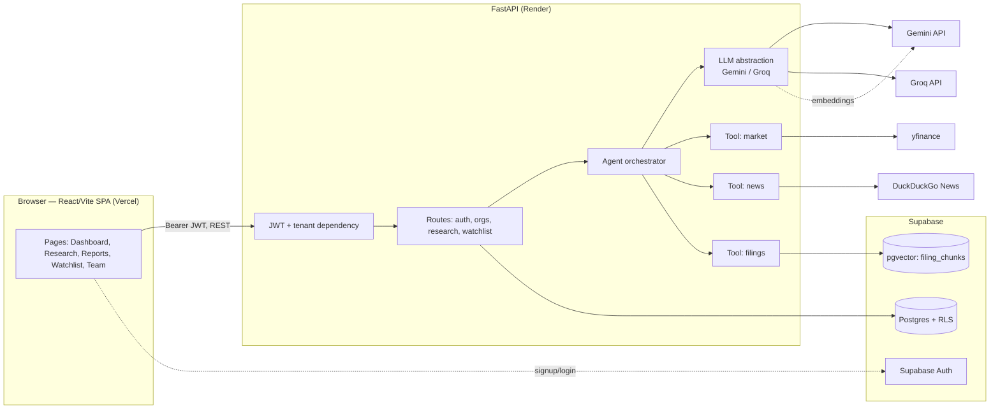
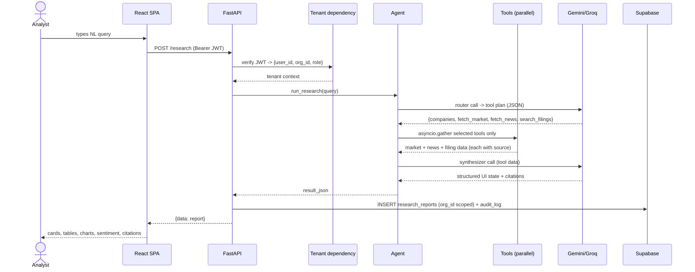
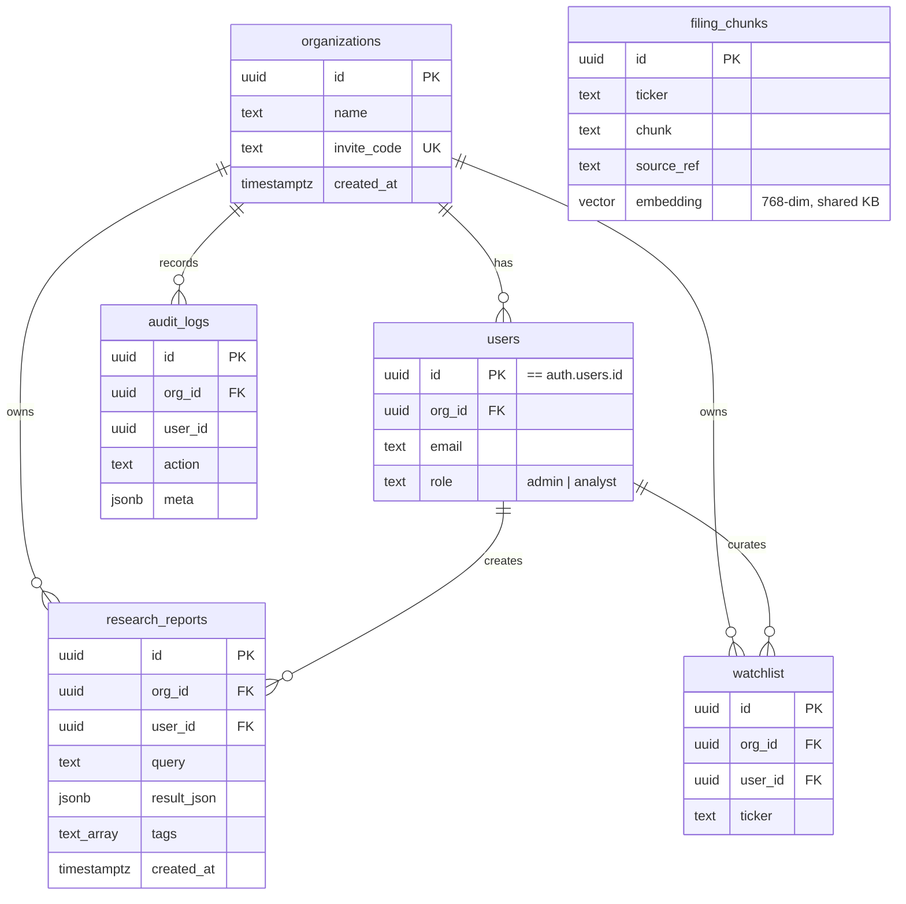
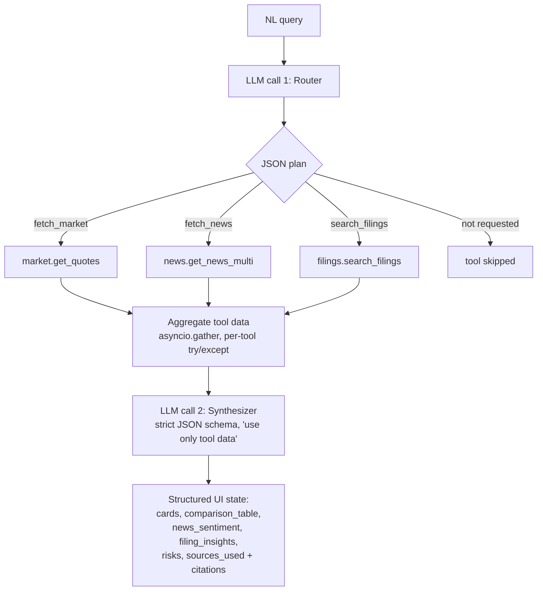
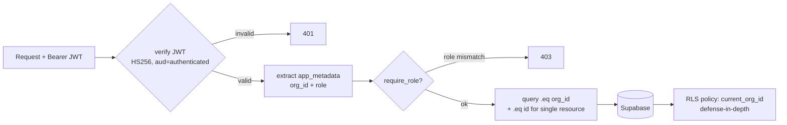

# Architecture

Klypup is an AI-powered investment research dashboard: an analyst types a natural-language query, an agentic LLM flow orchestrates data tools (market data, news+sentiment, SEC-filing vector search), and the result renders as structured, source-attributed UI. Multi-tenant with RBAC.

## System Architecture

## Data Flow

A research query, end to end:

## Database Schema / ER

`filing_chunks` is shared reference data (same SEC filings for all orgs) so it has no `org_id`. Indexes: `org_id` on every tenant table, `(org_id, created_at desc)` on reports, GIN on `tags`, IVFFlat cosine on `embedding`.

## AI Orchestration Flow

The router chooses tools per query (a news-only query skips market and filings). Tools run concurrently; one failing degrades gracefully. Provider abstraction retries twice then fails over Gemini↔Groq.

## Multi-Tenant Data Flow

Isolation is enforced in app code because the backend uses the Supabase **service key, which bypasses RLS**. RLS policies exist as defense-in-depth.

`org_id` and `role` live in the JWT's `app_metadata` (server-controlled, not user-editable). Org A's token can never resolve to Org B's `org_id`, and every query filters by it — single-resource ops filter by both `org_id` and `id` (IDOR guard).

## API Design

All responses use a consistent envelope — success: `{data, meta}`, error: `{error:{code,message,details}, meta}`. Protected routes require `Authorization: Bearer <jwt>` and resolve `org_id`/`role` from the token; every query is org-scoped.

| Method | Path | Auth | Role | Body / Notes |
|---|---|---|---|---|
| GET | `/health` | none | — | liveness |
| POST | `/auth/signup` | none | — | `{email,password, org_name \| invite_code}` → creates org (admin) or joins (analyst) |
| POST | `/auth/login` | none | — | `{email,password}` → `{access_token,...}` |
| POST | `/auth/logout` | yes | any | audit + client drops token |
| GET | `/auth/me` | yes | any | current user/org/role |
| GET | `/orgs/invite` | yes | **admin** | org invite code |
| GET | `/orgs/members` | yes | any | org member list |
| POST | `/research` | yes | any | `{query}` → runs agent, saves + returns structured report |
| GET | `/research?q=&tag=` | yes | any | list (search + tag filter), org-scoped |
| GET | `/research/{id}` | yes | any | single report (org_id+id) |
| PATCH | `/research/{id}` | yes | any | `{tags?,query?}` rename/retag |
| DELETE | `/research/{id}` | yes | any | 204 |
| GET | `/watchlist` | yes | any | user's tickers |
| POST | `/watchlist` | yes | any | `{ticker}` upsert |
| DELETE | `/watchlist/{ticker}` | yes | any | 204 |
