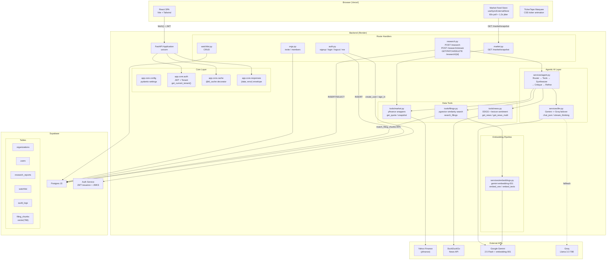
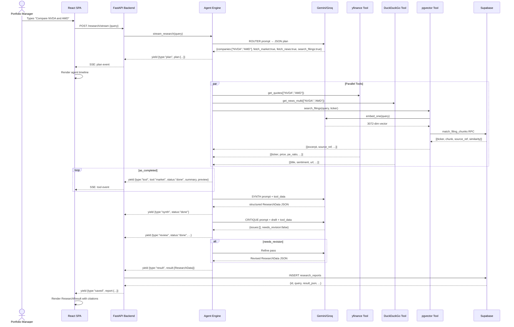
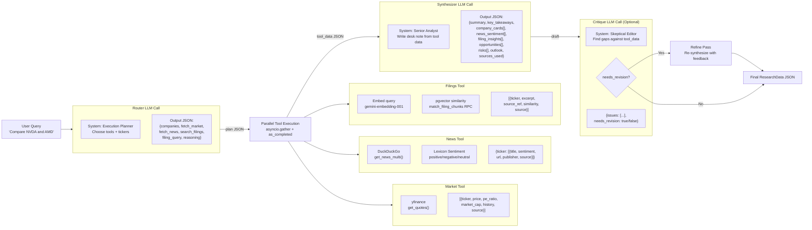
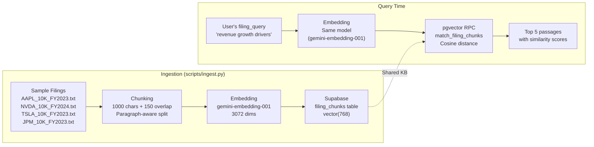
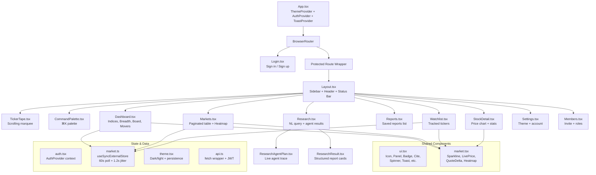
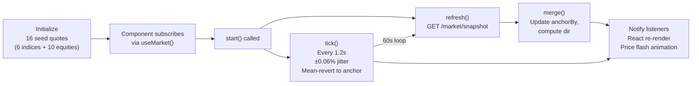
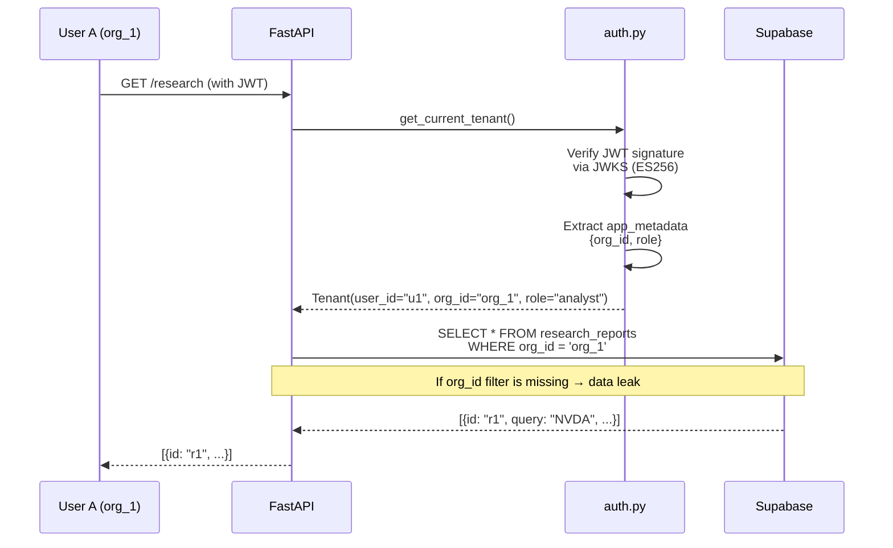
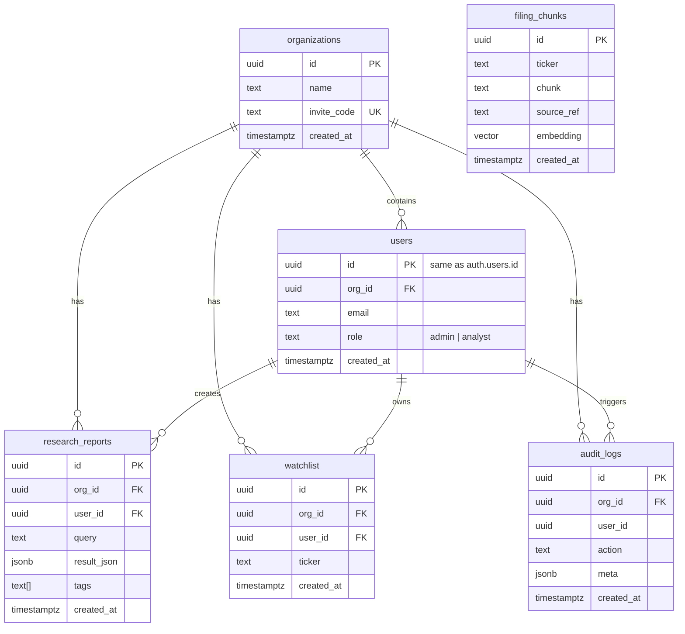
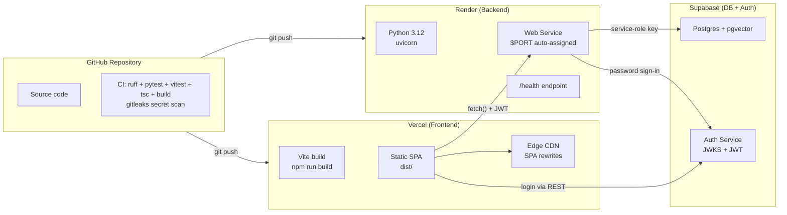

<p align="center">
  
</p>

# Architecture Guide

## System Overview

Klypup is a **three-tier investment research platform** built as a React/Vite single-page application frontend, a FastAPI Python backend, and a Supabase Postgres database with pgvector. The core differentiator is an **agentic LLM flow**: a user types a natural-language research query, the backend orchestrates two LLM calls (router → synthesizer) and three data tools (market data, news+sentiment, SEC-filing vector search) to return structured, sourced analysis.

### Architectural Pattern

**Monolithic backend with service-key Supabase.** The backend is a single FastAPI process. It uses Supabase's service-role key, which bypasses Row-Level Security — tenant isolation is enforced entirely in application code via a `get_current_tenant()` FastAPI dependency. This is the single highest-risk architectural decision and is documented in [`docs/DECISIONS.md`](decisions.md).

### Stack Summary

| Layer | Technology | Deployment |
|-------|-----------|------------|
| Frontend | React 19, TypeScript, Vite 5, Tailwind CSS | Vercel |
| Backend | Python 3.12+, FastAPI, Uvicorn | Render |
| Database | Supabase Postgres 15 + pgvector | Supabase |
| Auth | Supabase Auth (JWT via ES256 JWKS) | Supabase |
| LLM (primary) | Google Gemini 2.5 Flash | Google AI |
| LLM (fallback) | Groq Llama 3.3 70B | Groq |
| Market data | yfinance | — |
| News | DuckDuckGo News API | — |
| Embeddings | Gemini text-embedding-001 (3072-dim) | Google AI |
| Vector store | pgvector (IVFFlat, cosine distance) | Supabase |

---

## System Architecture Diagram



---

## Data Flow: Research Query Lifecycle



---

## Agentic AI Layer

The agent engine (`backend/app/services/agent.py`) is the intellectual core of the platform. It implements a **two-LLM-call agentic flow** with an optional critique/refine loop.

### Router-Synthesizer Architecture



### LLM Provider Abstraction

The LLM layer (`backend/app/services/llm.py`) wraps both providers behind a single function:

```python
def chat_json(system: str, user: str) -> dict:
    """
    - Retries primary provider twice (0.5s, 1.0s backoff)
    - On failure, fails over to secondary
    - Uses native JSON mode (response_mime_type="application/json" for Gemini,
      response_format={"type": "json_object"} for Groq)
    - Raises RuntimeError if both providers are down
    """
```

| Feature | Function | Provider |
|---------|----------|----------|
| JSON completion | `chat_json()` | Gemini → Groq |
| With thinking | `chat_json_thinking()` | Gemini only |
| Streaming + thinking | `stream_thinking()` | Gemini only |
| Streaming via thread | `_stream_llm()` | Bridge for async context |

**Model versions:**
- Gemini: `gemini-2.5-flash` (temperature: 0.2)
- Groq: `llama-3.3-70b-versatile` (temperature: 0.2)

---

## Embedding Pipeline

The embeddings system (`backend/app/services/embeddings.py`) is used by the SEC filing knowledge base. The pipeline flows through three stages:

### Architecture



### Key Details

| Aspect | Detail |
|--------|--------|
| Model | `gemini-embedding-001` |
| Dimensions | **3072** (stored as `vector(768)` — see note below) |
| Chunk size | 1000 characters |
| Chunk overlap | 150 characters |
| Index | IVFFlat with cosine distance, `lists = 10` |
| Similarity function | `1 - (embedding <=> query_embedding)` (cosine) |
| Max results | 5 per query |
| Optional filter | By ticker symbol |

> **Note on dimensions:** The code declares `embedding vector(768)` in the migration but the Gemini model `text-embedding-001` produces 3072 dimensions. The migration was written for an earlier 768-dim model. In production, this discrepancy must be reconciled — either by switching to a 768-dim model (e.g., `text-embedding-004`) or updating the schema to `vector(3072)` and rebuilding the index.

### Chunking Strategy

The ingestion script (`backend/scripts/ingest.py`) uses a **paragraph-aware character window** approach:

1. Split document on double newlines (`\n\n`) into paragraphs
2. Accumulate paragraphs into chunks up to 1000 characters
3. When a paragraph would overflow, flush the current chunk, then seed the next chunk with the last 150 characters of the previous one + the new paragraph
4. Each chunk gets a `source_ref` like `"AAPL 10-K FY2023 — chunk 3"`

### Source Attribution

Every document in the `sample_filings/` directory follows the naming convention:

```
<TICKER>_<DOCTYPE>_<PERIOD>.txt
```

Examples: `AAPL_10K_FY2023.txt`, `NVDA_10K_FY2024.txt`

This is parsed by the `source_ref()` function to generate human-readable citations that are surfaced in the UI alongside every filing insight.

---

## Data Tools

### Market Tool (`backend/app/tools/market.py`)

| Function | Cache | Returns | Used By |
|----------|-------|---------|---------|
| `get_quote(ticker)` | 300s | Full financial metrics + 3mo price history | Research agent |
| `get_quotes(tickers)` | per-call | Batch of `get_quote` results, errors isolated | Research agent |
| `quote_compact(yf_ticker)` | 120s | Lightweight `{price, prevClose, history}` | Dashboard snapshot |
| `snapshot(symbols)` | per-call | Array of compact quotes with change/changePct | `GET /market/snapshot` |

**Return format (get_quote):**
```json
{
  "ticker": "AAPL",
  "name": "Apple Inc.",
  "price": 226.8,
  "currency": "USD",
  "market_cap": 3500000000000,
  "pe_ratio": 30.2,
  "eps": 7.5,
  "revenue": 391000000000,
  "volume": 50000000,
  "fifty_two_week_high": 250.0,
  "fifty_two_week_low": 180.0,
  "history": [{"date": "2024-01-15", "close": 225.3}, ...],
  "source": "yfinance"
}
```

**Return format (snapshot):**
```json
{
  "symbol": "AAPL",
  "price": 226.80,
  "prevClose": 225.10,
  "change": 1.70,
  "changePct": 0.76,
  "history": [310.85, 312.51, ...],
  "currency": "USD",
  "source": "yfinance"
}
```

**Index mapping:**
| Friendly | yfinance symbol |
|----------|----------------|
| SPX | `^GSPC` |
| NDX | `^NDX` |
| DJI | `^DJI` |
| VIX | `^VIX` |
| BTC | `BTC-USD` |
| US10Y | `^TNX` |

### News + Sentiment Tool (`backend/app/tools/news.py`)

| Function | Cache | Returns | Used By |
|----------|-------|---------|---------|
| `get_news(ticker, max_results=6)` | 600s | Articles with sentiment labels | Research agent |
| `get_news_multi(tickers)` | — | Dict mapping ticker → `get_news` results | Research agent |

**Sentiment algorithm:** A lightweight lexicon-based approach using word sets:

| Sentiment | Example trigger words |
|-----------|---------------------|
| Positive | surge, beat, beats, growth, record, profit, bullish, soar, rally |
| Negative | miss, misses, loss, drop, fall, decline, downgrade, bearish, lawsuit |
| Neutral | Any text without sufficient signal words |

Score = `(positive_count - negative_count) / (positive_count + negative_count)`, clamped to 0.0 for ties.

**Return format:**
```json
{
  "title": "Apple Reports Record Q4 Revenue",
  "url": "https://...",
  "publisher": "Reuters",
  "date": "2024-12-15T10:00:00Z",
  "excerpt": "Apple Inc. reported record revenue...",
  "sentiment": "positive",
  "sentiment_score": 0.67,
  "source": "duckduckgo-news"
}
```

### SEC Filing Tool (`backend/app/tools/filings.py`)

| Function | Returns | Used By |
|----------|---------|---------|
| `search_filings(query, ticker, k=5)` | Similar passages with citations | Research agent |

The tool:
1. Embeds the query via `embed_one()` using Gemini
2. Calls the Postgres RPC `match_filing_chunks` with the vector, match count, and optional ticker filter
3. Returns passages sorted by cosine similarity descending

**Return format:**
```json
{
  "ticker": "NVDA",
  "excerpt": "Revenue for fiscal 2024 was $60.9 billion...",
  "source_ref": "NVDA 10-K FY2024 — chunk 3",
  "similarity": 0.87,
  "source": "sec-filing-kb"
}
```

---

## Frontend Architecture

### Component Tree



### State Management

| Store | Mechanism | Key State |
|-------|-----------|-----------|
| Auth | React Context (`AuthProvider`) | `{user, loading}` |
| Theme | React Context + localStorage | `dark` / `light` |
| Market feed | `useSyncExternalStore` | ~16 quotes, polled + cosmetic jitter |

The market feed is particularly notable:



---

## Multi-Tenant Isolation

### Isolation Strategy

**Tenant isolation is enforced in application code, not by Row-Level Security.** The backend uses Supabase's service-role key which bypasses RLS. Every protected route depends on `get_current_tenant()`, which decodes the JWT and returns `Tenant(user_id, org_id, role)`. Every database query must filter by `org_id`.



### RBAC Model

| Role | Access |
|------|--------|
| `admin` | Full access + invite code management + member management |
| `analyst` | Full read/write on research, watchlist, market data (no admin features) |

Enforced via `require_role("admin")` dependency on admin-only routes.

### IDOR Guard

Single-resource endpoints filter by **both** `org_id` AND resource `id`:

```python
rows = db().table("research_reports").select("*").eq(
    "org_id", t.org_id).eq("id", report_id).execute().data
```

This prevents user A (org_1) from accessing user B's (org_2) report even if they guess the UUID.

---

## Database Schema

### Entity Relationship Diagram



### Key Indexes

| Table | Index | Purpose |
|-------|-------|---------|
| users | `idx_users_org` on `org_id` | Org-scoped user queries |
| research_reports | `idx_reports_org_created` on `(org_id, created_at desc)` | Dashboard listing |
| research_reports | `idx_reports_tags` GIN on `tags` | Tag filtering |
| watchlist | Unique on `(org_id, user_id, ticker)` | Prevent duplicates |
| audit_logs | `idx_audit_org` on `(org_id, created_at desc)` | Audit trail queries |
| filing_chunks | `idx_filing_embedding` IVFFlat on `embedding` | ANN vector search |

---

## Deployment Architecture



### Environment Variables

**Frontend (Vercel):**

| Variable | Example | Purpose |
|----------|---------|---------|
| `VITE_API_URL` | `https://api.onrender.com` | Backend base URL |

**Backend (Render):**

| Variable | Example | Purpose |
|----------|---------|---------|
| `SUPABASE_URL` | `https://project.supabase.co` | Supabase project URL |
| `SUPABASE_KEY` | `eyJ...` (service-role key) | Admin access to DB |
| `SUPABASE_JWT_SECRET` | hex string | JWT verification |
| `LLM_PROVIDER` | `gemini` | Primary LLM (`gemini` / `groq`) |
| `GEMINI_API_KEY` | `AIza...` | Gemini access |
| `GROQ_API_KEY` | `gsk_...` | Groq fallback access |
| `CORS_ORIGINS` | `https://app.vercel.app` | Allowed frontend origins |

---

## Response Envelope

Every API response follows a consistent envelope:

**Success:**
```json
{
  "data": { ... },
  "meta": {}
}
```

**Error:**
```json
{
  "error": {
    "code": "internal_error",
    "message": "something went wrong",
    "details": null
  },
  "meta": {
    "request_id": "uuid"
  }
}
```

---

## Project Directory Structure

```
klypup/
├── backend/
│   ├── app/
│   │   ├── main.py                  # FastAPI entry point, CORS, router mounting
│   │   ├── core/
│   │   │   ├── auth.py              # JWT verification + tenant resolution
│   │   │   ├── cache.py             # In-process TTL cache decorator
│   │   │   ├── config.py            # pydantic-settings (env vars)
│   │   │   └── responses.py         # Response envelope + error handlers
│   │   ├── models/
│   │   │   └── schemas.py           # Pydantic request/response models
│   │   ├── routes/
│   │   │   ├── auth.py              # Signup/login/logout/me
│   │   │   ├── market.py            # Live market snapshot
│   │   │   ├── orgs.py              # Org invite + member management
│   │   │   ├── research.py          # AI research CRUD + streaming
│   │   │   └── watchlist.py         # User watchlist CRUD
│   │   ├── services/
│   │   │   ├── agent.py             # Router → tools → synthesizer orchestration
│   │   │   ├── db.py                # Supabase service-role client
│   │   │   ├── embeddings.py        # Gemini text embedding wrapper
│   │   │   └── llm.py               # LLM abstraction (Gemini/Groq)
│   │   └── tools/
│   │       ├── filings.py           # pgvector SEC filing search
│   │       ├── market.py            # yfinance quote wrappers
│   │       └── news.py              # DuckDuckGo news + sentiment
│   ├── migrations/
│   │   ├── 001_init.sql             # Core schema + RLS policies
│   │   └── 002_filings.sql          # pgvector + filing_chunks + match RPC
│   ├── scripts/
│   │   ├── ingest.py                # Filing chunking + embedding pipeline
│   │   ├── seed.py                  # 2-org demo data seeder
│   │   └── sample_filings/          # Sample 10-K/10-Q documents
│   └── tests/
│       ├── test_agent.py            # Mocked agent flow tests
│       ├── test_chunker.py          # Document chunking logic
│       ├── test_sentiment.py        # Lexicon sentiment accuracy
│       └── test_tenant_scoping.py   # Static org_id regression guard
│
├── frontend/
│   ├── src/
│   │   ├── main.tsx                 # React entry point
│   │   ├── App.tsx                  # Router + providers
│   │   ├── index.css                # Tailwind + design tokens + animations
│   │   ├── components/
│   │   │   ├── Layout.tsx           # App shell (sidebar, header, ticker)
│   │   │   ├── TickerTape.tsx       # Scrolling market marquee
│   │   │   ├── market.tsx           # Sparkline, LivePrice, Heatmap, etc.
│   │   │   ├── ResearchResult.tsx   # Structured report renderer
│   │   │   ├── ResearchAgentPlan.tsx # Live agent timeline
│   │   │   ├── CommandPalette.tsx   # ⌘K command palette
│   │   │   ├── ui.tsx              # Design primitives (Panel, Badge, etc.)
│   │   │   └── Logo.tsx            # Brand logo SVG
│   │   ├── pages/
│   │   │   ├── Dashboard.tsx        # Home page with market overview
│   │   │   ├── Login.tsx            # Auth page with demo fill
│   │   │   ├── Research.tsx         # NL query + streaming results
│   │   │   ├── Markets.tsx          # Paginated market board
│   │   │   ├── Reports.tsx          # Saved report list
│   │   │   ├── Watchlist.tsx        # User watchlist
│   │   │   ├── StockDetail.tsx      # Price chart + stats
│   │   │   ├── Settings.tsx         # Theme + account
│   │   │   ├── Members.tsx          # Admin: invite + roles
│   │   │   └── Styleguide.tsx       # Dev component reference
│   │   └── lib/
│   │       ├── api.ts              # Fetch wrapper with JWT
│   │       ├── auth.tsx            # Auth context
│   │       ├── market.ts           # Live feed store (useSyncExternalStore)
│   │       └── theme.tsx           # Theme context
│   └── vercel.json                 # SPA rewrites configuration
│
├── docker-compose.yml               # One-command local development
├── render.yaml                      # Render blueprint
├── .github/workflows/ci.yml         # CI (ruff, pytest, vitest, tsc, gitleaks)
└── docs/
    ├── architecture.md              # This file
    ├── api-reference.md             # API endpoint documentation
    └── DECISIONS.md                 # Architecture Decision Records
```
